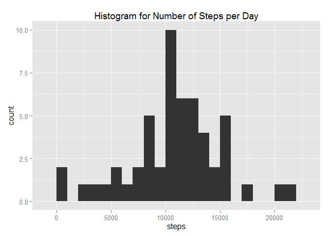
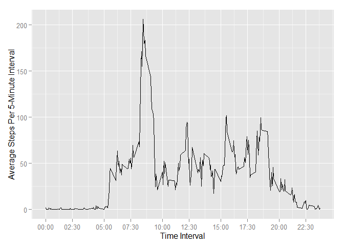
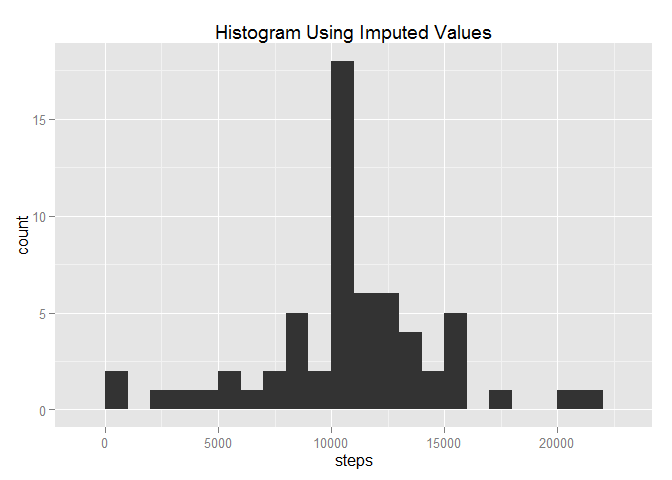
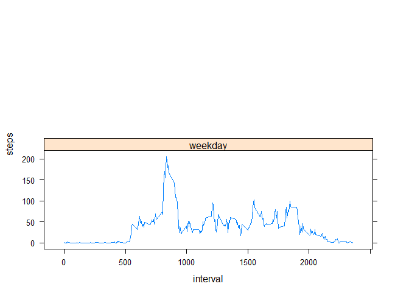

# Reproducible Research: Peer Assessment 1


## Loading and preprocessing the data
Load the data (i.e. read.csv())

```r
activity<-read.csv("activity.csv");
```

Process/transform the data (if necessary) into a format suitable for your analysis


```r
library(plyr);


activity$date<-as.Date(activity$date)

actsum<-ddply(activity, "date", summarize, 
              steps=sum(steps),
              interval=sum(interval))

act2<-activity[complete.cases(activity),]

act2$time<-strptime((sapply(act2$interval, formatC, width = 4, flag = 0)), format = "%H%M")
act2$time <- format(act2$time,"%H:%M")

actsum2<-ddply(act2, "date", summarize, 
              steps=sum(steps),
              interval=sum(interval),
              time=max(time))

intervalsum2<-ddply(act2, "time", summarize, 
              date=mode(date),
              steps=mean(steps),
              interval=max(interval))
```


## What is mean total number of steps taken per day?
Make a histogram of the total number of steps taken each day


```r
library(ggplot2)
qplot(steps, data=actsum2, main='Histogram for Number of Steps per Day', binwidth=1000)
```

 


Calculate and report the mean and median total number of steps taken per day


```r
mean(actsum2$steps)
```

```
## [1] 10766.19
```

```r
median(actsum2$steps)
```

```
## [1] 10765
```


## What is the average daily activity pattern?
Make a time series plot (i.e. type = "l") of the 5-minute interval (x-axis) and the average number of steps taken, averaged across all days (y-axis)

```r
qqq<-intervalsum2$time
aaa<-intervalsum2$interval
a1<-aaa[seq(1,length(aaa),30)]
q1<-qqq[seq(1,length(qqq),30)]

ggplot(data = intervalsum2, aes(interval, steps )) + geom_line() + scale_x_continuous(breaks=a1, labels=q1) + ylab("Average Steps Per 5-Minute Interval") + xlab("Time Interval")
```

 

Which 5-minute interval, on average across all the days in the dataset, contains the maximum number of steps?


```r
maxint<-intervalsum2$interval[which(intervalsum2$steps == max(intervalsum2$steps))]
maxtime<-intervalsum2$time[which(intervalsum2$steps == max(intervalsum2$steps))]
```


## Imputing missing values

Calculate and report the total number of missing values in the dataset (i.e. the total number of rows with NAs)


```r
x<-(is.na(activity$steps))
numna<-sum(x)
```

Devise a strategy for filling in all of the missing values in the dataset. The strategy does not need to be sophisticated. For example, you could use the mean/median for that day, or the mean for that 5-minute interval, etc.


```r
stepmeans<-ddply(act2,~interval,summarise,mean=mean(steps))
interval<-stepmeans$interval
#datemeans<-ddply(activity,~date,summarise,mean=mean(steps))
df<-activity

for (i in 1:length(df[, 1])){
    if (is.na(df[i,1]))
        {df[i,1]<-stepmeans[which(interval==df[i,3]), 2]}
    else if (is.na(df[i,1])==FALSE)
      {df[i,1]<-df[i,1]}

}
```

Create a new dataset that is equal to the original dataset but with the missing data filled in.


```r
stepmeans<-ddply(act2,~interval,summarise,mean=mean(steps))
interval<-stepmeans$interval
#datemeans<-ddply(activity,~date,summarise,mean=mean(steps))
df<-activity

for (i in 1:length(df[, 1])){
    if (is.na(df[i,1]))
        {df[i,1]<-stepmeans[which(interval==df[i,3]), 2]}
    else if (is.na(df[i,1])==FALSE)
      {df[i,1]<-df[i,1]}

}
```

Make a histogram of the total number of steps taken each day and Calculate and report the mean and median total number of steps taken per day.


```r
df$time<-strptime((sapply(df$interval, formatC, width = 4, flag = 0)), format = "%H%M")
df$time <- format(df$time,"%H:%M")

dfsum2<-ddply(df, "date", summarize, 
              steps=sum(steps),
              interval=sum(interval),
              time=max(time))

qplot(steps, data=dfsum2, main='Histogram Using Imputed Values', binwidth=1000)
```

 

```r
oldmean<-mean(actsum2$steps)
oldmedian<-median(actsum2$steps)

impmean<-mean(dfsum2$steps)
impmedian<-median(dfsum2$steps)
```


## Are there differences in activity patterns between weekdays and weekends?

Create a new factor variable in the dataset with two levels – “weekday” and “weekend” indicating whether a given date is a weekday or weekend day.


```r
for (i in 1:length(df[, 2])){
    if (weekdays(df[i, 2])=="Saturday")
        {df$weekend[i]<-'weekend'}
    else if ((weekdays(df[i, 2])=="Sunday"))
        {df$weekend[i]<-'weekend'}
    else {df$weekend[i]<-'weekday'}
}

 dfweekend<-ddply(df,~time*weekend,summarise,
                  date=mode(date),
                  steps=format(mean(steps), scientific = NA),
                  interval=max(interval),
                  time=max(time))
```

Make a panel plot containing a time series plot (i.e. type = "l") of the 5-minute interval (x-axis) and the average number of steps taken, averaged across all weekday days or weekend days (y-axis). The plot should look something like the following, which was creating using simulated data:

```r
library(lattice)

dfweekend <- transform(dfweekend, weekend = factor(weekend))
x<-dfweekend$interval
y<-dfweekend$steps
z<-dfweekend$weekend
dfweekend$steps<-as.numeric(dfweekend$steps)


xyplot(steps~interval|weekend, data=dfweekend, type='l', layout=c(1, 2))
```

 

